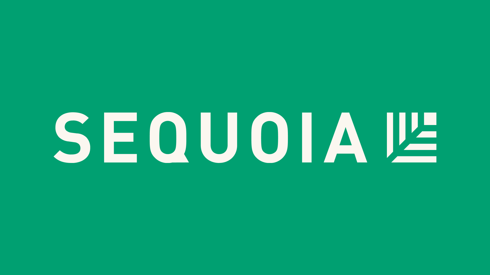

<div align="center">
  
  <h1>Sukoon MCP</h1>
  <p><strong>Indian mutual fund data for Claude.</strong> 17 tools covering 14,000+ AMFI schemes, 20 years of daily NAV, risk metrics, holdings, benchmarks, and SIF strategies.</p>
  <p>Leave a ⭐️</p>
  <p><a href="https://sukoon.money">sukoon.money</a> &nbsp;·&nbsp; No signup &nbsp;·&nbsp; No API key &nbsp;·&nbsp; Free for individuals</p>
</div>

---

## Connect in 3 clicks (Claude Web)

1. Go to **claude.ai** → Settings → Connectors
2. Paste the URL: `https://mcp.sukoon.money/mcp`
3. Set auth to **None**, click Connect

Open a new chat, look for the Sukoon chip, and start asking.

---

## Connect via Claude Desktop / Cursor / Cline

Add to your `claude_desktop_config.json` (or equivalent):

```json
{
  "mcpServers": {
    "sukoon": {
      "command": "npx",
      "args": ["-y", "sukoon-mcp"]
    }
  }
}
```

No environment variable needed. Reload Claude Desktop and the Sukoon server shows as connected.

---

## Tools

| Tool | What it does |
|------|-------------|
| `search_funds` | Search by fund name; filter by SEBI category or AMC |
| `list_categories` | All 40 SEBI categories with fund count |
| `list_amcs` | All AMCs with fund count |
| `list_funds_in_category` | Funds in a category ranked by any metric |
| `get_fund` | Fund info: name, AMC, ISIN, TER, min investment, launch date |
| `get_nav_history` | Daily NAV series, filterable by date range (up to 20 years) |
| `get_latest_nav` | Latest NAV with 1-day change % |
| `get_trailing_returns` | 1W / 1M / 3M / 6M / 1Y / 3Y / 5Y returns |
| `get_metrics` | Sharpe, Sortino, max drawdown, alpha, beta, IR, category rank percentile |
| `get_category_stats` | Median and average metrics across all funds in a category |
| `compare_funds` | Side-by-side comparison for 2–10 funds |
| `screen_funds` | Filter by category, min return, max TER, min Sharpe |
| `get_holdings` | Top portfolio holdings with % NAV weight |
| `find_funds_holding` | Which funds hold a given stock (name or ISIN) |
| `get_benchmark` | NIFTY / BSE TRI series with optional date range |
| `list_sif_strategies` | All 57 SIF strategies with latest NAV |
| `get_sif_metrics` | Performance metrics for a SIF strategy |

---

## Things to ask Claude

```
Compare Parag Parikh Flexi Cap and HDFC Flexi Cap over the last 5 years.
Find all large-cap index funds with TER under 0.10% that beat NIFTY 100.
What is the max drawdown of Quant Small Cap?
Which funds hold Zomato with more than 3% weight?
Show me NIFTY 50 TRI vs Mirae Asset Large Cap returns since 2015.
Screen for mid-cap funds with Sharpe above 0.8 and 3Y return above 18%.
What SIF strategies does Edelweiss offer?
```

---

## Data sources

- **NAV**: AMFI daily publish, updated every morning
- **Holdings**: BSE/NSE monthly disclosures
- **Benchmarks**: NIFTY 50, NIFTY 100, NIFTY 200, NIFTY 500, NIFTY Midcap 150, NIFTY Smallcap 250, NIFTY Next 50, BSE Sensex, BSE 500, and more
- **SIF strategies**: SEBI-registered Specialised Investment Funds (57 strategies)
- **TER**: AMFI daily disclosures

---

## Built by

<p>
  
  &nbsp;&nbsp;
  
  &nbsp;&nbsp;
  
  &nbsp;&nbsp;
  
  &nbsp;&nbsp;
  
</p>

Sukoon is built by alums of BITS Pilani, Nomura, Revolut, Samsung Research, and Sequoia Capital.

We believe every retail investor in India deserves the same data quality their wealth manager has. Sukoon makes that available through Claude, for free, forever.

Join the advisory waitlist at [sukoon.money](https://sukoon.money).

---

## License

MIT. See [LICENSE](LICENSE).
